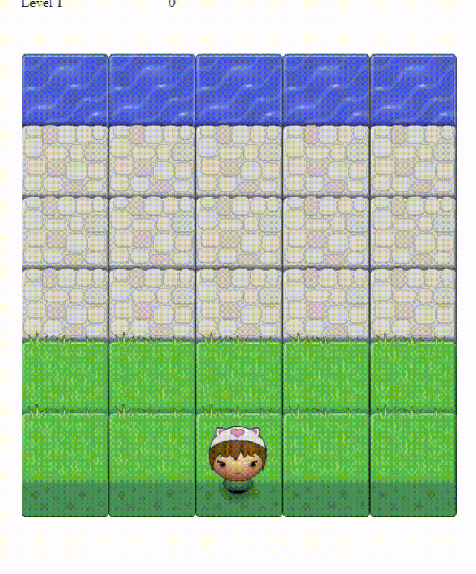

# [Classic Arcade Game Clone](https://github.com/udacity/frontend-nanodegree-arcade-game)

In this game you have a Player and Enemies (Bugs). The goal of the player is to reach the water, without colliding into any one of the enemies. The player can move left, right, up and down. The enemies move in varying speeds on the paved block portion of the scene. Once a the player collides with an enemy, the game is reset and the player moves back to the start square. Once the player reaches the water the game is won.

## Demo

[](https://github.com/salsan/frontend-nanodegree-arcade-game)

> [Check it live](https://salsan.github.io/frontend-nanodegree-arcade-game/).

## Usage

In order to play the game properly, consider the following steps:

1. Clone project:

    ```
    $ [sudo] git clone https://github.com/salsan/frontend-nanodegree-arcade-game.git
    ```

2. Serve the application:

    ```
    $ [sudo] python -m SimpleHTTPServer
    ```

3. Open the game:

    ```
    $ open "http://localhost:8000"
    ```

## Contributing

1. Fork it!
2. Create your feature branch: `git checkout -b my-new-feature`
3. Commit your changes: `git commit -m "Add some feature"`
4. Push to the branch: `git push origin my-new-feature`
5. Submit a pull request  :)

English is the universal language nowadays, so please don't create or comment on issues using another language.

## License

[MIT License](https://github.com/salsan) © Salvatore Santagati
